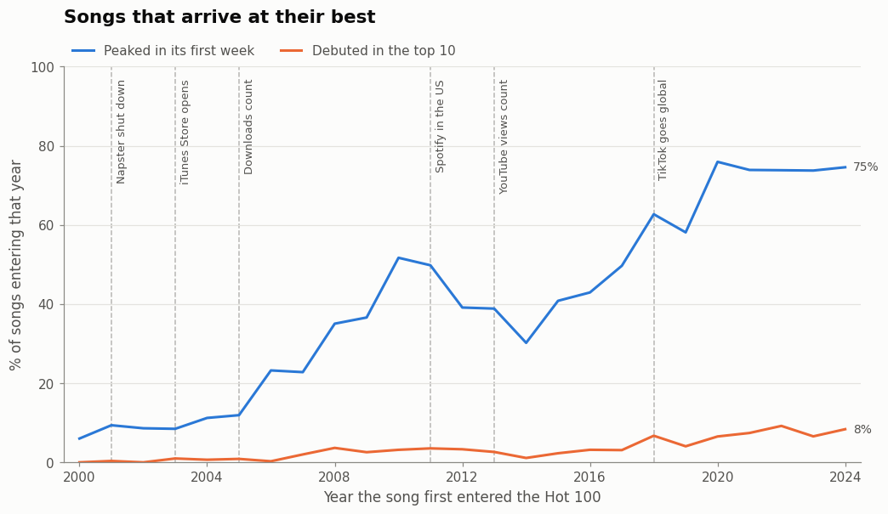
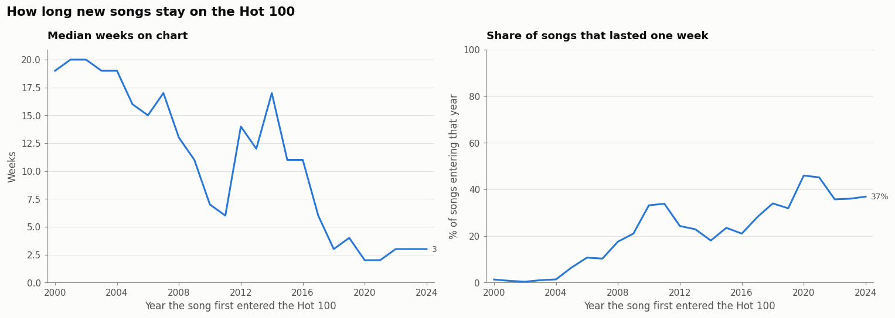
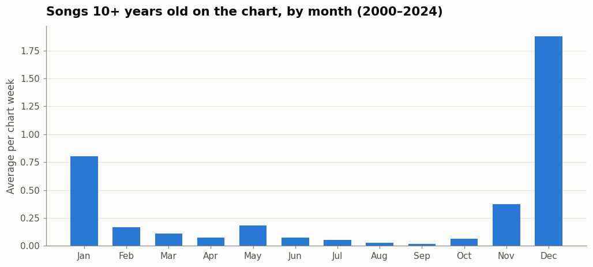

# 25 Years of the Billboard Hot 100 (2000–2024)

How has the way songs reach and stay on the Billboard Hot 100 changed since 2000, as the music industry moved from CDs to downloads to streaming?

This notebook follows the **11,026 songs that entered the Hot 100 between 2000 and 2024**, using every weekly chart since 1958. It runs on a free public dataset, and anyone can reproduce it without an account or API key.

## Key findings

| | 2000 | 2024 |
|---|---|---|
| Songs that peaked in their first week | 6% | **75%** |
| Median weeks a new song stays on the chart | 19 | **3** |
| New songs that lasted only one week | 1% | **37%** |
| New songs entering the chart that year | 316 | **621** |
| New songs credited to more than one artist | 18% | **36%** |

**1. Songs now arrive at their best.** In 2000, a song usually climbed the chart for weeks before peaking. By 2024, three out of four new songs had their highest position in the week they debuted. With streaming, a song's biggest week is usually the first one.



**2. More songs, shorter stays.** Twice as many new songs enter the chart each year, but the typical song stays for 3 weeks instead of 19. The busiest weeks are album releases, when streams of a whole album push many tracks onto the chart at once. Taylor Swift placed 31 of the 33 new songs in the week of 4 May 2024 (*The Tortured Poets Department*).



**3. Old songs are coming back, mostly at Christmas.** Before 2012, songs more than 10 years old almost never appeared on the chart. By 2024, up to 11 of them could appear in a single week. Most of them are Christmas classics, led by Mariah Carey's *All I Want for Christmas Is You* (68 weeks) and Brenda Lee's *Rockin' Around the Christmas Tree* (51 weeks).



**4. The artists who dominated.** Counting songs credited to them as lead artist, Taylor Swift has the most weeks on the chart (1,770) and the most number ones (12). She is followed by Drake (1,723 weeks, 10 number ones) and Rihanna (899 weeks, 11 number ones).

## Data and method

- **Source:** the [rwd-billboard-data](https://github.com/utdata/rwd-billboard-data) archive by UT Data. It has 355,600 rows: every weekly Hot 100 from August 1958 to September 2026. Chart data © Billboard.
- **Pinned version:** the notebook downloads a fixed snapshot of the file (commit from 25 Sept 2026), so the results stay the same even if the source is updated later.
- **Matching songs across weeks:** the data has no song ID, so I built one from the cleaned title plus the lead artist. I checked it two ways:
  - It failed to link only 19 of 319,230 week-to-week rows.
  - Its week counts match Billboard's own `wks_on_chart` for **99.0%** of songs.
- **Data quality checks:** I checked that every chart week has exactly 100 entries. I also standardised how "not on the chart last week" is recorded, since the source records it in two different ways.

## Limitations

- **The chart measures different things over time.** The Hot 100 added downloads (2005), on-demand streaming (2012) and YouTube views (2013), so some trends reflect changes in the rules as well as changes in listening.
- **Old songs can only come back under strict rules.** Billboard only lets an older song re-enter the chart if it reaches the top 50. This means older songs are undercounted.
- **Artist credit formats changed.** The "Featuring" share drops in 2022 when the data source changed how it records artist credits, so I focus on multi-artist credits overall.
- **Lead credit only.** Featured appearances don't count toward an artist's totals.

## How to run it

Requires Python 3.10+.

```bash
git clone https://github.com/Boiler82/billboard-25-year-analysis.git
cd billboard-25-year-analysis
python -m venv .venv
source .venv/bin/activate      # Windows: .venv\Scripts\activate
pip install -r requirements.txt
```

Open `billboard-25-year-analysis.ipynb` in VS Code or Jupyter, select the `.venv` kernel and choose **Run All**. The first run downloads the data (about 10 seconds) and saves it to `data/`. Later runs use the saved copy.

## Tools

Python · pandas · NumPy · matplotlib · Jupyter

---

*Fabio Boila, Data Analyst student at Hyper Island, Stockholm. [LinkedIn](https://www.linkedin.com/in/fabioboila) · [GitHub](https://github.com/Boiler82)*
